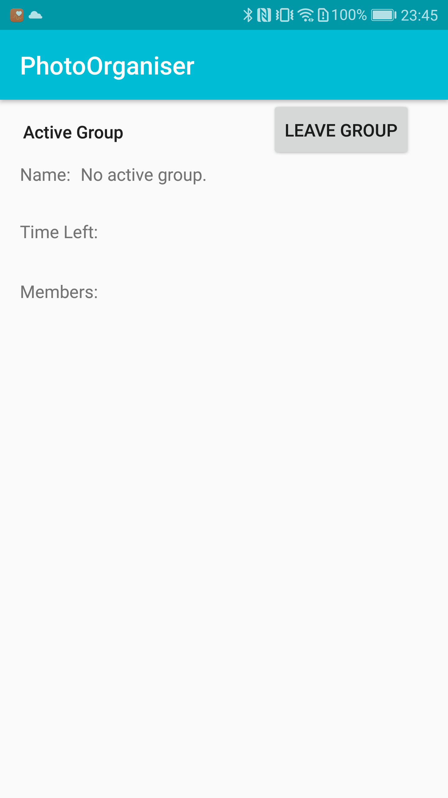
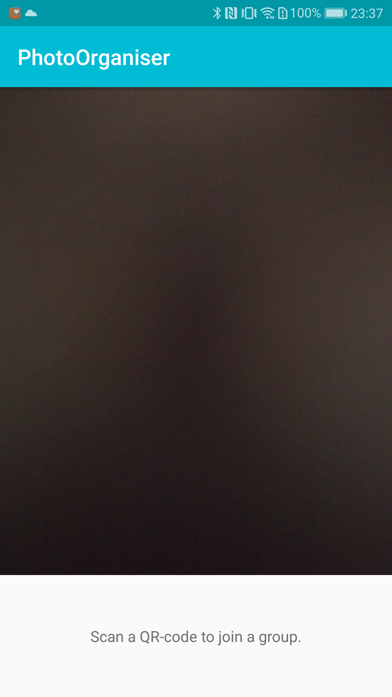
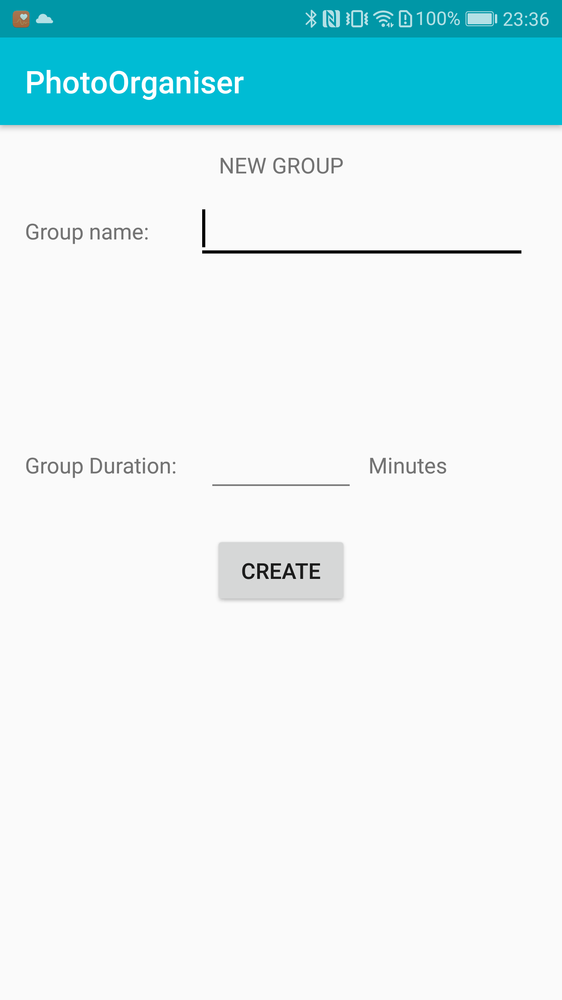
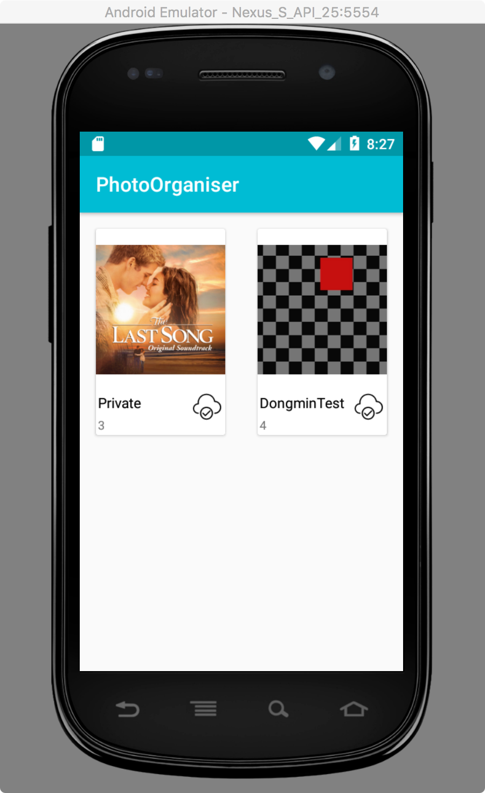
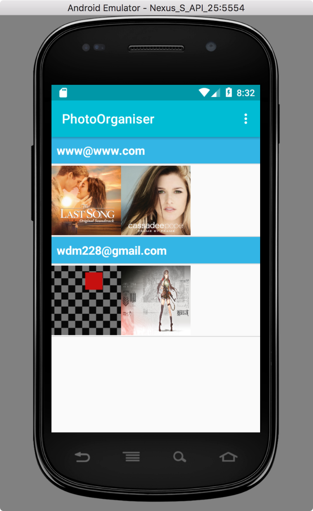
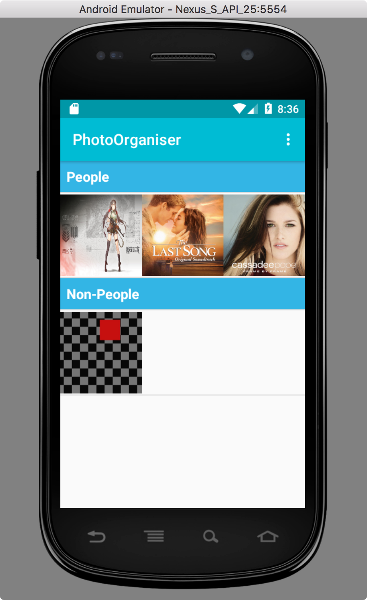
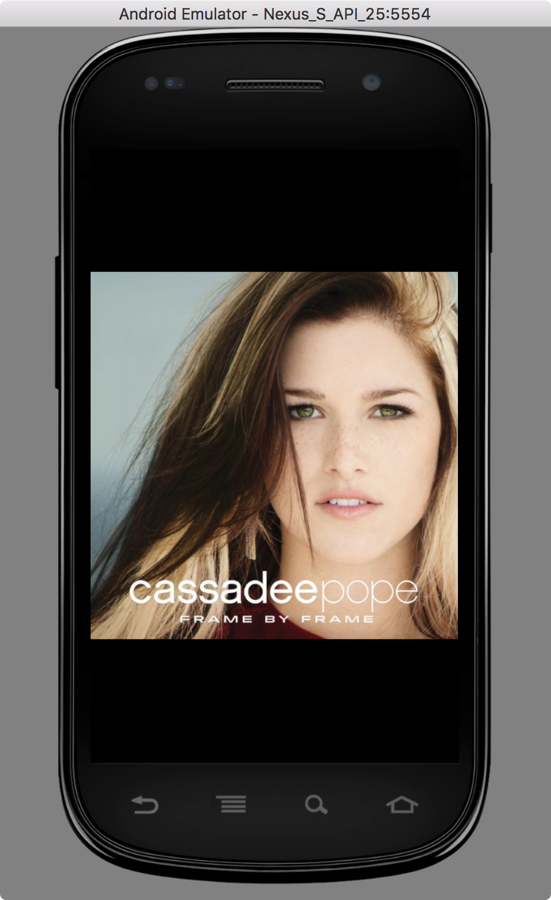
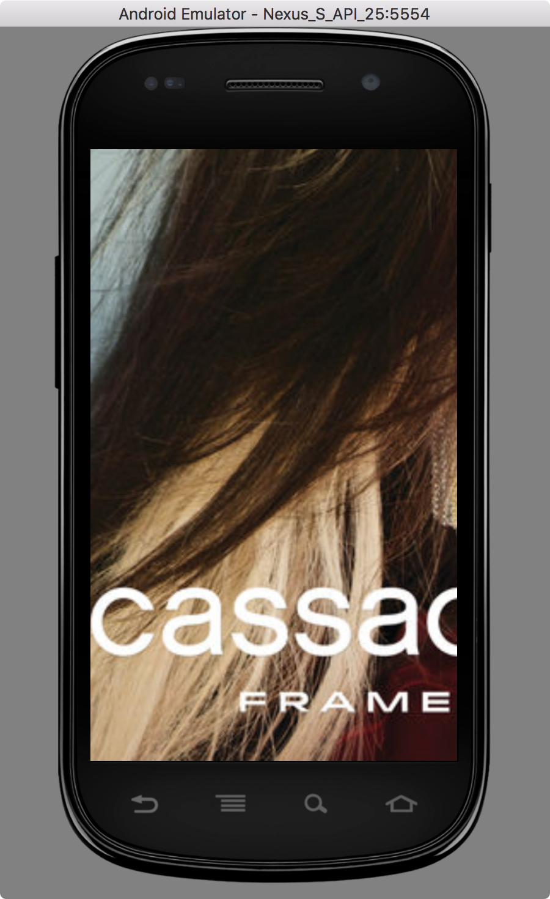

# Project of CSE4100


##Overview

This is the course project of CS-E4100 - Mobile Cloud Computing, 13.09.2017-23.11.2017. Project description is found lower down in the README file.

## Group information

- Forsman, Kenneth Sebastian (kenneth.forsman@aalto.fi)
- Jain, Tanvi (tanvi.jain@aalto.fi)
- Kaisti, Oliver (oliver.kaisti@aalto.fi), 429348
- Lähetkangas, Roope Kasperi (roope.lahetkangas@aalto.fi)
- Wu, Dongmin (dongmin.wu@aalto.fi), 605308

## How did you divide the work between the team members - who did what?

### Forsman, Kenneth Sebastian
- node.js api
- google cloud

### Jain, Tanvi
- Authentication and login
- firebase

### Kaisti, Oliver
- Project manager
- Group mamagement: add group, create group, join group, delete group
- firebase

### Lähetkangas, Roope Kasperi
- Take Photo for gallery

### Wu, Dongmi
- Gallery
- firebase
- google cloud

## Group Management

- Group management contains actions for Creating, Joining, Deleting and Listing Group information:

- The groupmanagement was done using java and firebase. Most of the work was done on the backend to sync firebase and the android application.

- What I (Oliver) learnt was to manage and use realtime databases and sync it with the application made in Androidstudio as well as android mobile app development and how to use google cloud services. 

- The most challenging part was to have and manage group permissions in a secure way.






## Gallery

The Gallery contains three views: Folder view, Album view and Photo view.


**Folder view**: Recycler view + Card view, there is a static "Private" folder with dynamic "Group" folder. The view will automatically synchronize with the server in every 10 seconds.




**Album view**: :List view + Recycler view + Image view. User can change the sorting by choosing different options at the right-top corner. For sorting in "Name" order, in case of missing user's name the application will set their email address as a alternative approach. Same as the Folder view, the Album view will sync with server in every 10 seconds.





**Photo view**: Based on the open source project [FrescoImageViewer](https://github.com/stfalcon-studio/FrescoImageViewer). The view is able to zoom in and out the picture smoothly.






## Learning Outcome

### Dongmin Wu

My part is the Gallery, there is a lot of challenges in this part. Main challenge is I am not familiar with the Android developing. I remember it costed me about two days for the first **Folder view**, but things became better day after day, although we cannot meet all the requirement but the result is ok I think.

From the technical aspect, there are two primary challenges: layout of **Album view** and the updating of UI. 

The challenge of layout is mainly from the Andriod itelf.
First, the layout is a complex and different from what we learned in previous assignments, especially the Recycler view. Which is new and functional but there is less tutorials on the Internet. Second, because of the sorting feature, I figured out a solution of putting Recycler views in a wrapper List view. I am not sure if that is the best practice of this senario, but it is complex and need to arrange code in a more structure way.

Updating UI task needs a good know of synchronization and a-synchronization. Android doesn't accept accessing the network from Main thread of an Activity. But I need to wait for the result from the server. My orginal solution is create a Async Okhttp3 client within the funciton "runOnUIThread", but I met the issue of I cannot query the server repeatedly. After referring to the API document of Android and Okhttp3, I found out a solution with Sync Okttp3 in an individual thread.

Learned a lot in this course but the time is too intensive for me as a freshman of Android developing.

<br><br>
<br><br>
<br><br>


# CS-E4100 Fall 2017

## Mobile Cloud Computing (5 cr)

## Group Project – Event-based picture sharing app

```
Deadline Sunday, 10 December 2017 at 23:59 (local time in Finland)
Submission Through the Aalto Version Control System (https://version.aalto.fi)
Revision v1.0 (01.11.2017)
Projects must be submitted according to the instructions in this document (see the “Sub-
mission” section for the details). No other form of submission will be accepted. Deadlines
are hard. No extensions will be granted. Should you have any issues in accessing My-
Courses, A+ or Aalto Version Control System, contact the course staff atcs-e4100@aalto.fi
as soon as possible. Also refer to the MyCourses workspace for additional information
(https://mycourses.aalto.fi/course/view.php?id=16930).
```
## Overview

```
Summary The purpose of the group project is to realize an application to share and synchronize pic-
tures between users. In particular, the application should support the creation of groups
of users participating to a certain event for sharing related pictures; this enables all pic-
tures taken by a user within a certain time period to be synchronized in real-time to all
other users belonging to the same group. To this end, the application also needs to support
authentication of users and the creation of groups. The pictures should be automatically
categorized on the cloud based on the presence of people (e.g., for selfies) or the lack thereof
(e.g., for landscapes). Finally, the application performs local image processing to avoid
sending pictures which contain sensitive information to the cloud, so as to preserve the
privacy of the users.
```
**Components** The application consists of two components: a frontend and a backend. Thefrontendis the
user interface running on a mobile device to access the functionalities of the service. The
backendconsists of a database and functions for processing and storage (see the “Backend”
section for more details).
**Users** The application must support one user per device and a user may be logged in on multiple
devices at once.

## Frontend

**Requirements** The frontend must be implemented as an Android application and must realize the follow-
ing functions.
**>** Provide a login screen to authenticate users; this can be supported by using FirebaseUI
Auth (https://firebase.google.com/docs/auth/).
**>** Allow users to take a picture (with the camera of their mobile device).
**>** Identify pictures that contain sensitive data by detecting the presence of a 2D barcode.
**>** Display a gallery with two types of albums: privateandgroup pictures. The private
album contains pictures that are sensitive (i.e., they contain a 2D barcode) and only
concerns to the main user; the other type of album stores all the group pictures shared
between the members of a group.


```
> Handle all operations without slowing down or freezing the user interface. Specifically,
processing and downloading should be done in the background. Additionally, the appli-
cation should properly manage loading and displaying large images without running out
of memory.
```
**Functionality** The frontend should first show a welcome screen prompting for password-based authen-
tication. Upon successful login, the frontend should show a grid menu layout with the
following options.
**>** Gallery.The gallery screen should display a grid of albums. Pictures that contain sen-
sitive information should be displayed in thePrivatealbum. For the group pictures, the
application must display albums with the name associated with the group (for instance,
Picnic, Wappu) and a picture belonging to that group. Inside each group album, the pic-
tures are divided in two categories:People, for the pictures containing faces, andNot
people, for all other pictures (i.e., those that do not contain faces). This categorization
is carried out at the backend. The application should also include an option to show
pictures grouped by the user who took them. The content of the albums should be au-
tomatically refreshed when other members of the group take pictures as long as these
pictures do not contain sensitive information. Synchronization should take place even
if the app is not in the foreground or if it is closed. A message in the notification bar
should inform the user whenever pictures are added to their gallery. The application
must provide an option to open the picture (in both portrait and landscape mode) and
support zooming. In addition, the interface should allow to download the picture in its
full resolution (refer to “App settings” below for additional details).
**>** Take picture. The frontend should provide a live camera preview and allow the user
to take a picture. Non-sensitive pictures taken by users should be synchronized across
all users belonging to the corresponding group. Upon taking a picture, an analysis is
carried out to detect if there is sensitive data (namely, 2D barcodes, for instance, those
that appear in a boarding pass). The detection should be carried out locally on the mobile
device and it should run in the background to guarantee that the camera does not freeze.
**>** Group management.The group management screen contains options for creating, join-
ing and leaving (or deleting) a group. Upon group creation the application shows a form
with different fields to setup the related properties. Among them, two fields are manda-
tory: the group name and its expiration, i.e., the time after which the event is over and
synchronization is no longer performed. Once the group is created, other members can
join that group by scanning a QR code which is displayed on the device of any of the
current members. To increase security, the QR code encodes a server-sidesingle-use to-
kenin addition to a group ID. Single-use means that the token expires after a user has
joined a group through that token. The application should automatically refresh the QR
code after the token has been used. Once a user is part of a group, he (she) can show the
QR code on his (her) device for others to join that group. The application must ensure
that each user belongs only to one group at a time. The frontend should display the list
of group members too. Each member of the group has the option of leaving the group.
When a user leaves a group all other users are notified but his (her) pictures must re-
main in the devices of the other group members. The creator of the group does not have
the option to leave the group but can delete a group instead. This means that the group
is no longer valid (i.e., as it instantly expires upon deletion).
**>** App settings.A settings screen should allow users to specify a different application be-
havior based on wireless connectivity, i.e., WiFi and mobile data. In particular, the set-


```
tings screen allows to specify the image quality when uploading or synchronizing pictures
under WiFi or mobile data network. The image resolution can below(640 by 480 pixels),
high(1280 by 960 pixels) andfull(original size).
```
## Backend

```
Architecture The backend must be implemented using Google App Engine Flexible Environment. The
application must use the Firebase Realtime Database to sync information across different
devices and Firebase Storage to store images.
```
**Requirements** The backend should provide APIs for group management as follows.
**>** Create a group, which returns a unique group ID and single-use token, which is used by
the frontend to create a QR code (refer to Section “Group management” under “Function-
ality”).
**>** Join a group, given the group ID and single-use token.
**>** Delete or leave a group, given the group ID. The operation depends on whether the user
trying to delete the group is the creator of the group. Only the creator of the group is
allowed to delete the group (which involves deleting all group information and pictures).
If the user attempting the operation is not the creator of the group, the user simply leaves
the group and cannot upload or download any further pictures from that group.

**Authorization** Only authenticated users should be able to carry out the operations listed above. This can
be done by verifying the User ID tokens (https://firebase.google.com/docs/auth/admin/
verify-id-tokens) on the backend. The APIs described earlier should at least return the
information described above; you can decide to include further information in the responses
sent by the backend.
**Other tasks** In addition, the backend should perform the following tasks:
**>** Delete the group when the lifetime of the group has elapsed. This includes deleting any
information about the group as well as the corresponding pictures stored in the cloud.
**>** Label uploaded images based on whether people are present in the picture or not (refer
to Section “Gallery” under “Functionality”).
**>** Save low resolution and high resolution versions of each uploaded picture (refer to Sec-
tion “App settings” under “Functionality”) in addition to the full resolution pictures.

**Access rules** Finally, the Firebase Realtime Database and Firebase Storage must make use of appropri-
ate rules so as to prevent access to unauthorized users. Specifically, the information of a
particular group (including the list of members, expiry time and user generated pictures)
should be accessible only to members belonging to the group. The pictures should not be
available publicly.

## Challenges

```
Overview The following tasksare not requiredto complete the project but give extra points. You can
pick any combination of the challenges listed below, however, the total number of extra
points given by the challenges is limited to a maximum of 10 points.
> Realize a responsive web application that allows to access the photo albums (as a fron-
tend) and include an option to delete pictures from the cloud, which is useful in case a
user cannot access the mobile application ( 4 points ).
> Allow users to join a group by shake pairing: a user can join a group if he (she) is phys-
ically close to a member of that group and they both shake their mobile devices at the
```

```
same time. The backend should detect the shake pairing and add the new user to the
relevant group ( 5 points ).
> Free challenge: do you have a good idea on how to improve this application? Are there
other features which would turn this into an app that people would like to use? Impress
us with these features and get extra points ( 1–10 points ).
```
## Submission

**Instructions** The project source code must be submitted through the Aalto Version Control System
(https://version.aalto.fi) on the git repository associated with your group. Specifi-
cally, the name of the repository is ‘mcc-fall-2017-gXX’, whereXXis your group number.
Additional information about using the Aalto Version Control system and the setup of
group-specific repositories is available in MyCourses under the “Software project” section
(https://mycourses.aalto.fi/course/view.php?id=16930&section=4). No explicit action
is required to submit the code: **the last commit before the submission deadline will
be used for evaluation**.
**Evaluation** Each group must show a demo of the software project to the teaching assistants. A time
for the demo has to be booked according to the instructions available in MyCourses under
the “Software project” section (https://mycourses.aalto.fi/course/view.php?id=16930&
section=4). The evaluation criteria for the software project are available in MyCourses
under the “Software project” section (https://mycourses.aalto.fi/course/view.php?id=
16930&section=4).


## Reference user interface

```
Sign up Grid Menu Gallery
```
```
Create group View group Join group
```
```
Album sorted by people Album sorted by author
```